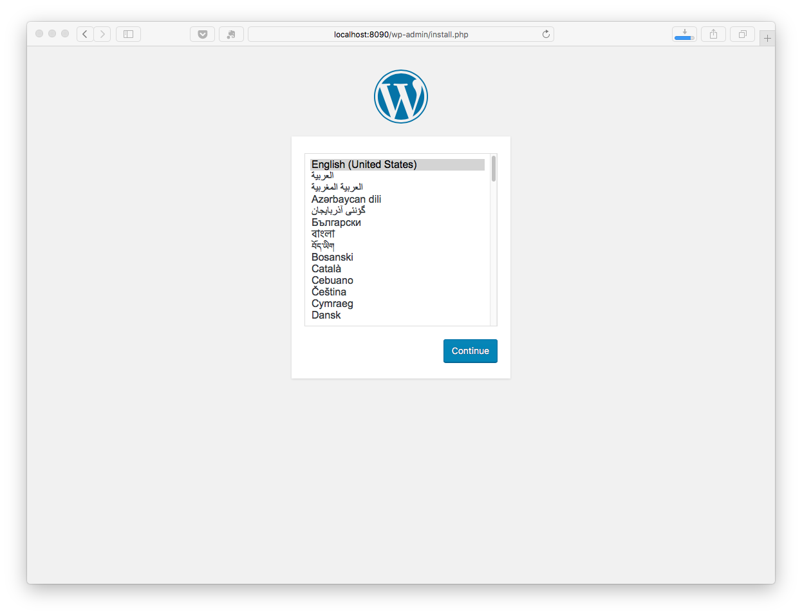
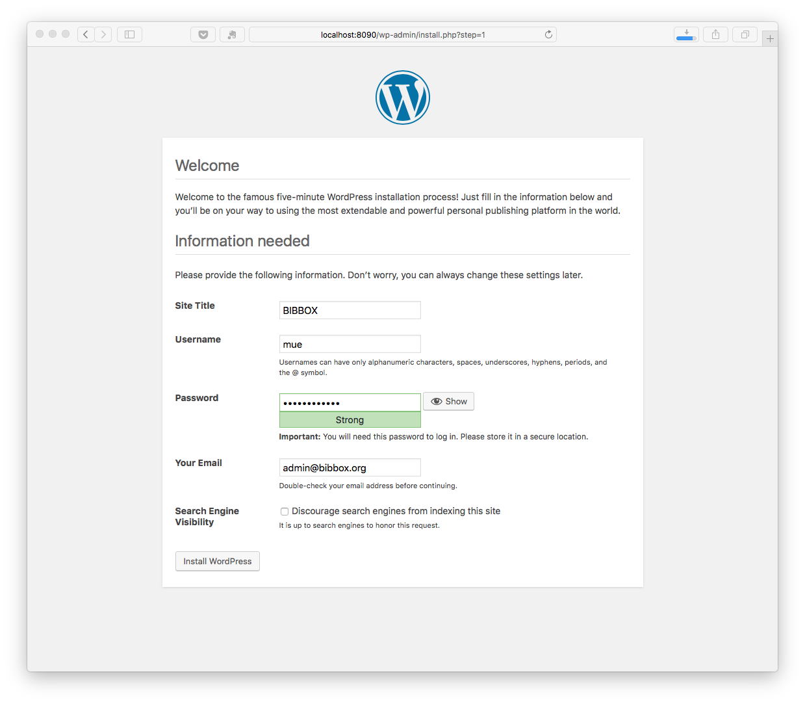
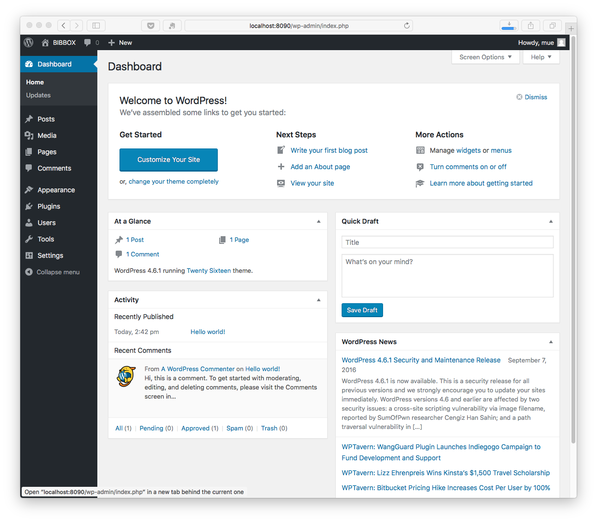

# WORDPRESS BIBBOX application

## Hints
* approx. time with medium fast internet connection: **5 minutes**
* initial user/passwordd: set at installation

## Docker Images Used
 * [wordpress](https://hub.docker.com/_/wordpress/), official wordpress container
 * [mariadb](https://hub.docker.com/_/mariadb/), offical mySQL container
 * [adminer](https://hub.docker.com/_/adminer/), db management tool
 
## Install Environment Variables
  *	MYSQL_ROOT_PASSWORD = password, only used within the docker container
  * MYSQL_DATABASE = name of the mysql database, typical *wordpress*. The DB file is stored in the mounted volume
  * MYSQL_USER = name of the mysql user, typical *wordpress*
  * MYSQL_PASSWORD = mysql user password, only used within the docker container

## Mounted Volumes

* the mysql datafolder _/var/mysql_ will be mounted to _/opt/apps/INSTANCE_NAME/var/mysql_ in your BIBBOX kit 

## Installation Instructions 

* Choose your language

* Define your Blog/Webpage title, your username and password and your e-mail adress. 

* In the dashboard you can configure wordpress, and finaly create your sites and posts. Just watch this short video, if you are new to wordpress: https://youtu.be/uwan-ofPGqQ

* And here the first view of your Webpage

## After the installation

Have a nice ride with the Admins youngtimer.

## Test if zip takes cached
